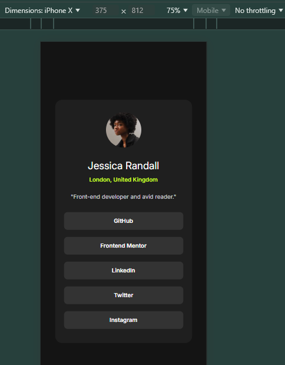

# Frontend Mentor - Social links profile solution

This is a solution to the [Social links profile challenge on Frontend Mentor](https://www.frontendmentor.io/challenges/social-links-profile-UG32l9m6dQ). Frontend Mentor challenges help you improve your coding skills by building realistic projects.

## Table of contents

- [Overview](#overview)
  - [Screenshot](#screenshot)
  - [Links](#links)
- [My process](#my-process)
  - [Built with](#built-with)
- [Author](#author)

## Overview

### The challenge

### Screenshot

### Links

- Live Site URL: [Click here to see the solution!](https://frontend-mentor-num-3-social-profile.netlify.app/)

## My process

### Built with

- Semantic HTML5 markup
- Mobile-first workflow
- A little of TypeScript
- [React](https://reactjs.org/) - JS library
- [Tailwind](https://tailwindcss.com/) - For styles

## Author

- My Portfolio - [My Portfolio](https://my-portfolio-coral-iota.vercel.app/)
- Frontend Mentor - [@EdelmiroAnton](https://www.frontendmentor.io/profile/EdelmiroAnton)
- Linkedin - [@EdelmiroAnton](https://www.linkedin.com/in/edelmiro-anton/)
